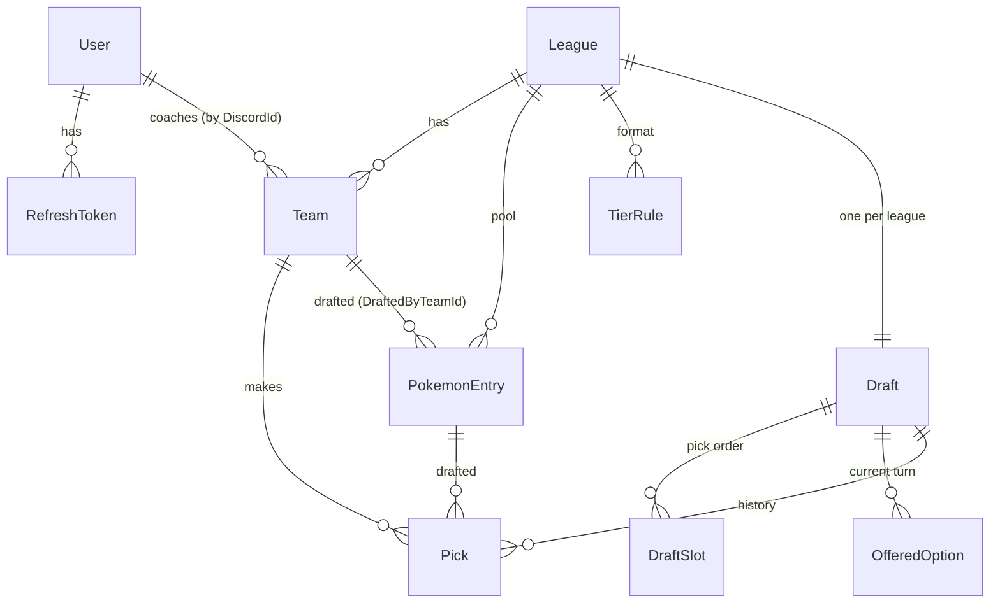
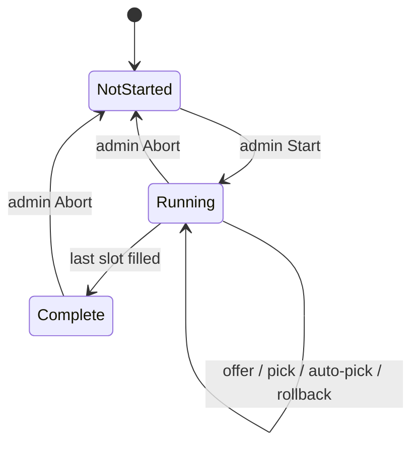

# Data model & draft process

The database is the single source of truth. The server engine owns every mutation
under one lock; clients only render state and post intents.

## Layers

| Layer | Does | Where |
| --- | --- | --- |
| Web client | Renders, posts tier/pick/start intents, listens for live updates | [web/](web/) |
| API | Authenticated HTTP, thin over the engine | [server/Api/](server/Api/) |
| Engine | All draft mutations, serialized under one lock | [server/Services/DraftEngine.cs](server/Services/DraftEngine.cs) |
| Clock | Background service; auto-picks when a deadline passes | [server/Services/DraftClock.cs](server/Services/DraftClock.cs) |
| Hub | SignalR push of turn/pick/state changes | [server/Hubs/DraftHub.cs](server/Hubs/DraftHub.cs) |
| DB | EF Core + SQLite | [server/Data/](server/Data/) |

## Entities

- **User**: one row per Discord account. `DiscordId` (the snowflake) is the
  system-wide identity (`Team.CoachId`, `DeviceRegistration.UserId`,
  `NotificationRecord.UserId` all hold it). `Username`/`AvatarHash` are display-only.
  `IsAdmin` gates start/abort/rollback. **RefreshToken**: long-lived, hashed.
- **League**: one season, with its own `Pool`, `Teams`, `TierRules`, one `Draft`.
  `PickTimerSeconds` (default 300) is the per-pick clock.
- **TierRule**: per-tier format, unique per `(LeagueId, Tier)`. `SlotsPerTeam` (how
  many of this tier a team drafts) and `OptionsOffered` (how many random options a
  coach is shown). Seeded format below.
- **PokemonEntry**: one draftable mon. `Tier` (S/A/B/C), `DexNumber`, `Sprite` (the
  Showdown slug, e.g. `charizard-megay`, distinguishing forms that share a dex).
  `DraftedByTeamId` is `null` while available and set once drafted, **this is how a
  mon leaves the pool.** Pool imported into
  [server/Data/pokemon-pool.json](server/Data/pokemon-pool.json) and loaded by
  [DevSeed](server/Data/DevSeed.cs).
- **Draft**: `State` (`NotStarted → Running → Complete`, plus `Paused`), `Order` (the
  flat snake sequence of `DraftSlot`s), `CurrentIndex` (whose turn), `PickDeadline`,
  `Offered` (current turn only), `Picks` (history).
- **DraftSlot**: one position, `Position` + `TeamId`. Built at Start; the engine just
  walks it (round *r* forward on even rounds, reversed on odd).
- **OfferedOption**: a mon on offer to the on-clock coach. Persisted so a refresh
  can't reroll; cleared on every advance/rollback/abort.
- **Pick**: authoritative record, `PickNumber`, `TeamId`, `PokemonEntryId`, `Tier`,
  `WasAutoPick`, `MadeAt`.

Seeded format:

| Tier | SlotsPerTeam | OptionsOffered |
| --- | --- | --- |
| S | 1 | 3 |
| A | 2 | 4 |
| B | 3 | 5 |
| C | 4 | 7 |

So each team drafts **S A A B B B C C C C**, 10 mons over 10 snake rounds.

## The draft process

1. **Seed** (dev only): create the league, tier rules, and pool, plus an **empty**
   draft. No teams or order are seeded.
2. **Authenticate**: Discord OAuth (PKCE), or in Development mint a token with
   `POST /dev/token/{discordId}?admin=true`. Each real sign-in becomes a participant.
3. **Start** (admin, `POST /api/admin/drafts/{id}/start`): gathers every signed-in
   user (the reserved `admin` excluded), gives each a Team if they lack one, builds the
   snake `Order`, sets `Running`, arms the clock. Re-starting after an abort rebuilds
   the roster.
4. **Offer** (on-clock coach, `POST /api/drafts/{id}/offer`): samples `OptionsOffered`
   undrafted mons of that tier into `Offered`. Re-opening the same tier returns the
   same set. A tier with no open slot for that team is rejected.
5. **Pick** (`POST /api/drafts/{id}/pick`): writes the `Pick`, stamps
   `DraftedByTeamId`, clears `Offered`, advances `CurrentIndex`, resets the clock,
   pushes `pickMade`/`turnChanged`. At `CurrentIndex == Order.Count` the draft is
   `Complete`.
6. **Auto-pick**: on a missed `PickDeadline`, [DraftClock](server/Services/DraftClock.cs)
   fills the least valuable open slot (walks C→B→A→S) and marks `WasAutoPick`.
7. **Rollback** (`POST /api/drafts/{id}/rollback`): returns the last mon to the pool
   and steps `CurrentIndex` back. Allowed for an admin **or** the coach who made it.
8. **Abort** (admin, `POST /api/admin/drafts/{id}/abort`): undoes every pick, restores
   the pool, clears the clock, returns to `NotStarted`.

All mutations serialize on one process-wide lock, so a coach's pick and the clock's
auto-pick can never both burn the same turn.

## Draft API + live updates

| Method | Route | Who |
| --- | --- | --- |
| GET | `/api/drafts` , `/api/drafts/{id}` | any signed-in |
| POST | `/api/drafts/{id}/offer` , `/pick` | on-clock coach |
| POST | `/api/drafts/{id}/rollback` | admin or last picker |
| POST | `/api/admin/drafts/{id}/start` , `/abort` | admin |

Live updates arrive on the `/hubs/draft` SignalR hub (`turnChanged`, `pickMade`,
`optionsOffered`, `pickSkipped`, `pickRolledBack`, `draftStateChanged`); the client
re-reads `GET /api/drafts/{id}` on each and falls back to 5s polling if the socket
drops.

## Beyond the draft

Once a draft completes, the season adds more entities and endpoints (see
[server/Api/ScheduleApi.cs](server/Api/ScheduleApi.cs)): a **Match** per round-robin
fixture, per-mon **PokemonStat** aggregates, and stored replay logs. Battles are
auto-reported from the Showdown server to `/api/showdown/report`, scored, and scraped
into stats by [ReplayStatsScraper](server/Services/ReplayStatsScraper.cs). See the
README for that pipeline.

## Frontend layout conventions

- **No page-level horizontal scrollbar at any width.** The root clips horizontal
  overflow (`html { overflow-x: hidden }`); anything genuinely wider (the stats table)
  scrolls inside its own `overflow-x: auto` box.
- **Full-bleed views** (`.layout`, `.stats-view`, `#view-teambuilder`) break out of
  `main`'s centered column with `width: 100vw` + `margin-left: calc(50% - 50vw)`.
  `100vw` counts the scrollbar gutter, so without the root clip they'd overflow a few
  px and add a permanent bottom scrollbar.
- **The tier list fits by design**: `.tl-grid` is `repeat(auto-fill, minmax(116px, 1fr))`.
  Change the `116px` minimum to reflow density, never add scroll.
- Prefer bounded, scoped scroll (`.sched-scroll` caps its own height) over pushing the
  page wider or taller.
