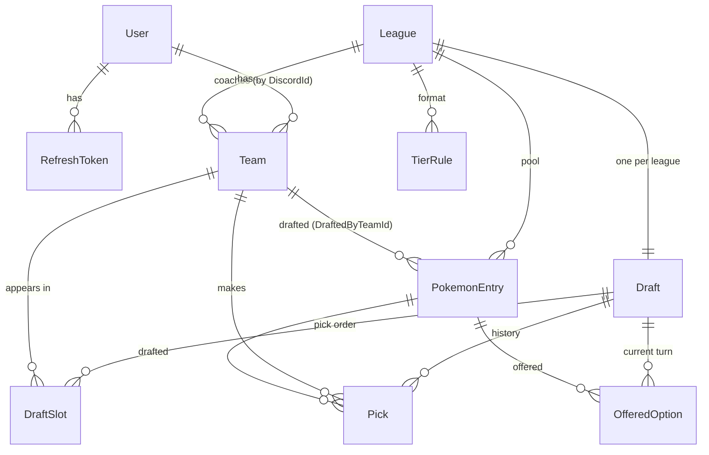
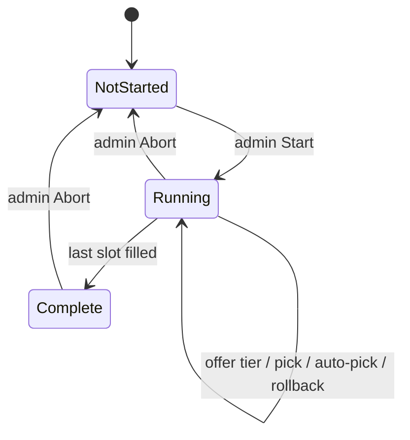

# Draft League — data model & draft process

How the pieces fit together, from identity through a completed snake draft. The
database is the single source of truth; the server engine owns every mutation,
and the web/app clients only render state and post intents.

## Layers

| Layer | What it does | Where |
| --- | --- | --- |
| **Web client** | Renders the draft, posts tier/pick/start intents, listens for live updates | [web/](web/) |
| **API** | Authenticated HTTP endpoints, thin over the engine | [server/Api/](server/Api/) |
| **Engine** | All draft mutations, serialized under one lock | [server/Services/DraftEngine.cs](server/Services/DraftEngine.cs) |
| **Clock** | Background service; fires auto-pick when a pick's deadline passes | [server/Services/DraftClock.cs](server/Services/DraftClock.cs) |
| **Hub** | SignalR push of turn/pick/state changes | [server/Hubs/DraftHub.cs](server/Hubs/DraftHub.cs) |
| **DB** | EF Core + SQLite, source of truth | [server/Data/](server/Data/) |

## Entities



### Identity

- **User** — one row per Discord account. `DiscordId` (the snowflake) is the
  system-wide identity: `Team.CoachId`, `DeviceRegistration.UserId` and
  `NotificationRecord.UserId` all hold it. `Username`/`AvatarHash` are cached for
  display only. `IsAdmin` gates start/abort/rollback. The reserved id `"admin"`
  (from `/dev/admin`) is an admin who is deliberately **not** a player and is
  filtered out of the roster.
- **RefreshToken** — long-lived, hashed; access tokens (JWTs) are short and
  carry the `admin` role claim when `IsAdmin`.

### League configuration

- **League** — one season: its own `Pool`, `Teams`, `TierRules`, and one
  `Draft`. `PickTimerSeconds` (default 300) is the per-pick clock.
- **TierRule** — per-tier format, unique per `(LeagueId, Tier)`:
  - `SlotsPerTeam` — how many of this tier each team must draft.
  - `OptionsOffered` — how many random options a coach is shown when they open
    this tier.
- **Team** — a coach's team. `CoachId` = the coach's `DiscordId`.

Current format (from the seed):

| Tier | Rarity colour | SlotsPerTeam | OptionsOffered |
| --- | --- | --- | --- |
| S | orange (legendary) | 1 | 3 |
| A | purple (epic) | 2 | 4 |
| B | green (uncommon) | 3 | 5 |
| C | blue (rare) | 4 | 7 |

So each team drafts **S A A B B B C C C C** — 10 mons over 10 snake rounds.

### Pool

- **PokemonEntry** — one draftable mon in a league's pool. `Tier` (S/A/B/C),
  `DexNumber`, and `Sprite` (the Pokémon Showdown slug, e.g. `charizard-megay`,
  which distinguishes mega/regional forms that share a dex number). Unique per
  `(LeagueId, Name)`. `DraftedByTeamId` is `null` while available and set once
  drafted — **this is how a mon leaves the pool**. The pool is imported from the
  source sheet into [server/Data/pokemon-pool.json](server/Data/pokemon-pool.json)
  (tiers S/A/B/C only; the sheet's Z/X rows are excluded) and loaded by
  [DevSeed](server/Data/DevSeed.cs).

### Draft

- **Draft** — one per league. `State` (`NotStarted → Running → Complete`, plus
  `Paused`), `Order` (the flat snake sequence of `DraftSlot`s), `CurrentIndex`
  (whose turn — an index into `Order`), `PickDeadline` (clock), `Offered` (the
  options for the current turn only), `Picks` (full history).
- **DraftSlot** — one position in the order: `Position` + `TeamId`. The engine
  does not compute the order; it just walks this list. The snake order is built
  **at Start** from the signed-in players (round *r* iterates teams forward on
  even rounds, reversed on odd), not seeded ahead of time.
- **OfferedOption** — a mon currently on offer to the coach on the clock.
  Persisted so a refresh can't reroll the sample; cleared on every advance,
  rollback, and abort.
- **Pick** — the authoritative record: `PickNumber`, `TeamId`, `PokemonEntryId`,
  `Tier`, `WasAutoPick`, `MadeAt`.

### Enums

- **Tier**: `S, A, B, C` (most valuable first; auto-pick walks them in reverse).
- **DraftState**: `NotStarted, Running, Paused, Complete`.

## The draft process



One turn, end to end:

```mermaid
sequenceDiagram
    participant C as Coach on clock
    participant API
    participant E as DraftEngine
    participant DB
    participant Hub as SignalR
    C->>API: POST /drafts/{id}/offer {teamId, tier}
    API->>E: OfferOptionsAsync
    E->>DB: sample N undrafted of tier → OfferedOption rows
    E->>Hub: optionsOffered
    Hub-->>C: refresh → options shown
    C->>API: POST /drafts/{id}/pick {teamId, pokemonEntryId}
    API->>E: MakePickAsync
    E->>DB: Pick row; PokemonEntry.DraftedByTeamId = team; clear Offered; CurrentIndex++
    E->>Hub: pickMade + turnChanged
    Hub-->>C: refresh → board + feed update, next coach on clock
```

Step by step:

1. **Seed** (dev only, [DevSeed](server/Data/DevSeed.cs)): create the league,
   tier rules, and pool (from the sheet), plus an **empty** draft. No teams and
   no order are seeded — the draft lines up whoever has signed in.
2. **Authenticate**: Discord OAuth (PKCE) → tokens; or, in Development, claim a
   debug slot (`/dev/slots/{i}/claim`) or sign in as the bare admin
   (`/dev/admin`). Each real sign-in becomes a draft participant.
3. **Start** (admin): `POST /api/admin/drafts/{id}/start` → `StartAsync` gathers
   every signed-in user (the reserved admin excluded), gives each a **Team** if
   they lack one, builds the snake `Order` over that roster, sets `Running`, arms
   the clock, and announces the first turn. Re-starting after an abort rebuilds
   the roster, so anyone who joined in between is included.
4. **Open a tier** (coach on the clock): `POST /api/drafts/{id}/offer` →
   `OfferOptionsAsync` samples `OptionsOffered` undrafted mons of that tier into
   `Offered`. Re-opening the same tier returns the same set (no reroll). Tiers
   with no remaining slot for that team are rejected.
5. **Pick**: `POST /api/drafts/{id}/pick` → `MakePickAsync` writes the `Pick`,
   stamps `DraftedByTeamId` (mon leaves the pool), clears `Offered`, advances
   `CurrentIndex`, resets the clock, and pushes `pickMade`/`turnChanged`.
6. **Advance**: when `CurrentIndex` reaches `Order.Count`, the draft is
   `Complete`.
7. **Auto-pick**: if `PickDeadline` passes, [DraftClock](server/Services/DraftClock.cs)
   calls `AutoPickAsync`, which fills the least valuable open slot (walks
   C→B→A→S) and marks the pick `WasAutoPick`.
8. **Undo** (`POST /api/drafts/{id}/rollback`): returns the last mon to the pool
   and steps `CurrentIndex` back. Allowed for an **admin or the coach who made
   that pick**.
9. **Abort** (admin, `POST /api/admin/drafts/{id}/abort`): `AbortAsync` undoes
   every pick, restores the whole pool, clears the clock, and returns the draft
   to `NotStarted` to run again.

All engine mutations serialize on a single process-wide lock, so a coach's pick
and the clock's auto-pick can never both burn the same turn.

## Key API surface

| Method | Route | Who | Purpose |
| --- | --- | --- | --- |
| GET | `/api/drafts` | any signed-in | List drafts (to find one to open) |
| GET | `/api/drafts/{id}` | any signed-in | Full draft state: teams, order, offered, picks |
| POST | `/api/drafts/{id}/offer` | on-clock coach | Open a tier, get options |
| POST | `/api/drafts/{id}/pick` | on-clock coach | Pick an offered mon |
| POST | `/api/drafts/{id}/rollback` | admin **or** last picker | Undo the last pick |
| POST | `/api/admin/drafts/{id}/start` | admin | Start the draft |
| POST | `/api/admin/drafts/{id}/abort` | admin | Reset the draft |

Live updates arrive on the `/hubs/draft` SignalR hub
(`turnChanged`, `pickMade`, `optionsOffered`, `pickSkipped`, `pickRolledBack`,
`draftStateChanged`); the client re-reads `GET /api/drafts/{id}` on each and
falls back to 5s polling if the socket drops.
